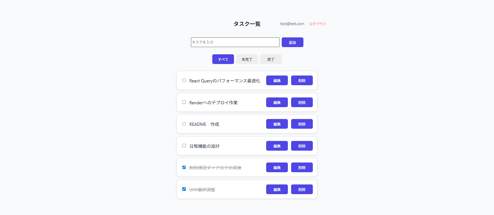
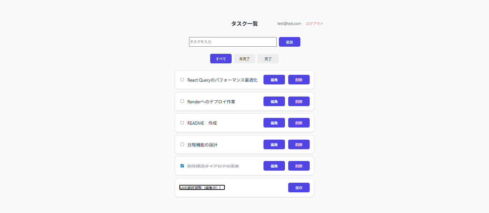
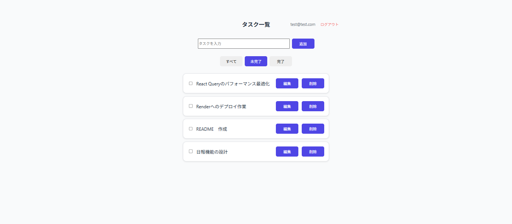

# タスク管理アプリ

## 📝 概要

Reactで作成したシンプルなタスク管理アプリです。
ユーザー認証（JWT）に対応しており、タスクの追加・編集・削除・完了管理を直感的に行えます。

特に、**楽観的UIやキーボード操作による快適なUX**を意識して設計しています。

---

## 🔗 デモ

* フロント: https://task-app-frontend-lrgl.onrender.com

---
## 🧪 デモ利用方法

以下のデモアカウントでログインしてお試しください。

メール: test@test.com  
パスワード: 123456 

※新規登録も可能です。

---

## 📷 スクリーンショット

### 一覧画面

### 編集機能

### フィルター機能

---

## ✨ 機能

* ユーザー認証（JWT）
* タスク管理機能

  * 追加
  * 編集（Enterで保存 / Escでキャンセル）
  * 削除（確認ダイアログ付き）
  * 完了切り替え
* フィルター機能（全て / 完了 / 未完了）
* トースト通知
* ローディング表示

---

## 🛠 技術スタック

### フロントエンド

* React（Hooks）
* React Query
* react-hot-toast

### バックエンド

* Node.js
* Express

### データベース

* Supabase（PostgreSQL）

### インフラ

* Render（Web Service / Static Site）

---

## 💡 工夫した点

* 楽観的UIによる高速な操作体験
* フォーカス制御によるスムーズな入力体験
* Enter / Escによる直感的な編集操作
* トーストメッセージの統一によるUX向上
* カスタムフック（useTasks）によるロジックとUIの分離

---

## 🚀 今後の改善

* 日報機能の追加
* UI/UXのさらなる改善
* テストの導入

---

## 🧠 学んだこと
- React Queryによるサーバー状態管理
- 楽観的UIの実装とrollback処理
- フロントとバックエンドの連携
- デプロイ（Render）と環境変数管理